<p align="center">
  <picture>
    <source media="(prefers-color-scheme: dark)" srcset="./assets/profile-header-dark.svg">
    <source media="(prefers-color-scheme: light)" srcset="./assets/profile-header-light.svg">
    
  </picture>
</p>

<p align="center">
  <a href="https://chengliang.pro"></a>
  <a href="https://chengliang.vercel.app"></a>
  <a href="mailto:liangcheng2456@163.com"></a>
  
</p>

<p align="center">
  
</p>

## `> whoami`

I'm **Liang Cheng (梁程 / Ray)**, an AI-native product engineer based in Nanjing. I turn fuzzy ideas into working, testable software—from tool-using agents and local-first RAG systems to polished web and iOS products.

- `NOW` Building real agent systems, reusable AI workflows, and stronger backend foundations
- `BIAS` Tool use over wrapper demos · evidence over pitch · shipping over slide decks
- `PAST` Built telecom-grade React, TypeScript, and ECharts systems at Huawei
- `EDU` QUT Computer Science graduate · IELTS 7.5

```ts
const liang = {
  focus: ["agent systems", "full-stack products", "indie iOS"],
  buildLoop: ["understand", "prototype", "verify", "ship"],
  principle: "Build the proof, not just the pitch.",
} as const;
```

## `// featured builds`

<table>
  <tr>
    <td width="50%" valign="top">
      <h3>🧊 <a href="https://github.com/CHENG-LIANG1/ModelForgeAgent">ModelForge Agent</a></h3>
      <p>A stateful 3D-building agent. Models choose typed tools; the host validates every mutation and renders the result in a Three.js editor.</p>
      <p><code>Agent Loop</code> <code>TypeScript</code> <code>Fastify</code> <code>React Three Fiber</code></p>
    </td>
    <td width="50%" valign="top">
      <h3>🔬 <a href="https://github.com/CHENG-LIANG1/SciFlow">SciFlow</a></h3>
      <p>A local-first research workspace with a React frontend, FastAPI backend, PostgreSQL/pgvector, and privacy-minded document retrieval.</p>
      <p><code>React</code> <code>FastAPI</code> <code>pgvector</code> <code>Docker</code> · <a href="https://sciflow-demo.vercel.app">Live demo ↗</a></p>
    </td>
  </tr>
  <tr>
    <td width="50%" valign="top">
      <h3>🧹 <a href="https://github.com/CHENG-LIANG1/clean-my-mac-codex">clean-my-mac for Codex</a></h3>
      <p>A safety-first Agent Skill for diagnosing macOS storage pressure with read-only scans, reversible quarantine, and explicit purge gates.</p>
      <p><code>Codex Skill</code> <code>Shell</code> <code>Safety by design</code></p>
    </td>
    <td width="50%" valign="top">
      <h3>⚡ <a href="https://github.com/CHENG-LIANG1/badass-skills">Badass Skills</a></h3>
      <p>A growing, bilingual library of production-grade AI Agent Skills—portable workflows with clear boundaries and observable outcomes.</p>
      <p><code>SKILL.md</code> <code>Agentic workflows</code> <code>Evaluation</code></p>
    </td>
  </tr>
</table>

## `// product shelf`

<p align="center">
  <a href="https://apps.apple.com/us/app/active-habit-tracker/id6758425099"></a>
  <a href="https://apps.apple.com/us/app/geekbio/id6758457562"></a>
  <a href="https://douban-lens.vercel.app"></a>
  <a href="https://click-arena.vercel.app"></a>
</p>

## `// toolkit`

<p align="center">
  
</p>

<p align="center">
  
  
  
  
  
</p>

## `// build signal`

<p align="center">
  
  
</p>

<picture>
  <source media="(prefers-color-scheme: dark)" srcset="./assets/github-snake-dark.svg">
  <source media="(prefers-color-scheme: light)" srcset="./assets/github-snake.svg">
  
</picture>

<p align="center">
  <a href="https://chengliang.pro">Portfolio</a> ·
  <a href="https://chengliang.vercel.app">Writing</a> ·
  <a href="https://github.com/CHENG-LIANG1?tab=repositories">All repositories</a> ·
  <a href="mailto:liangcheng2456@163.com">Let's build something</a>
</p>

<p align="center"><sub>Build the proof. Keep the taste. Ship the thing.</sub></p>
